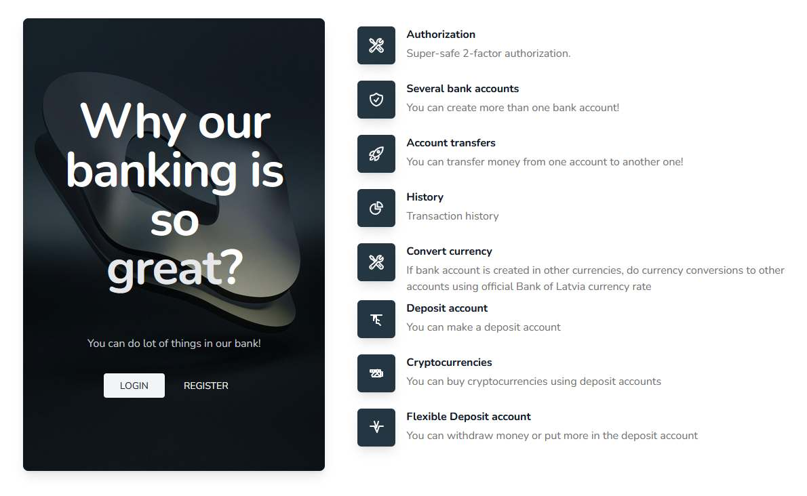
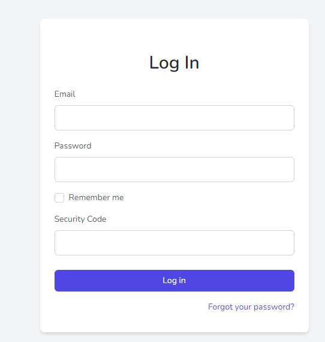
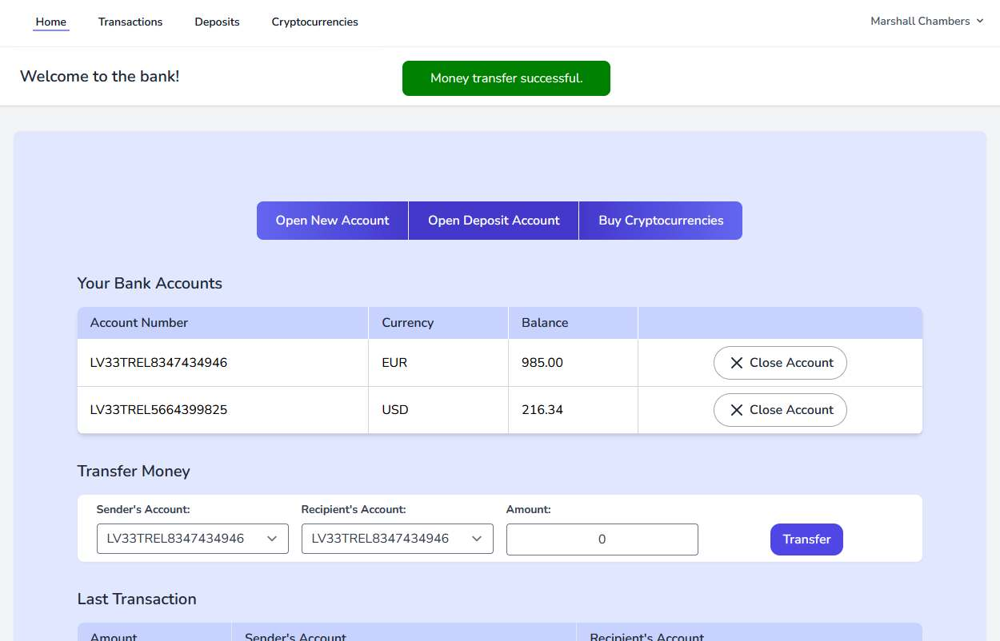
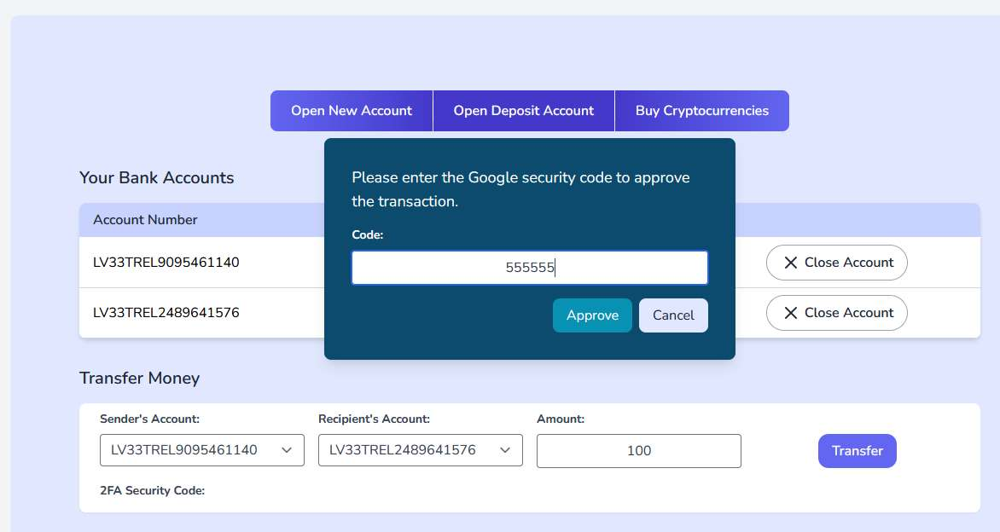
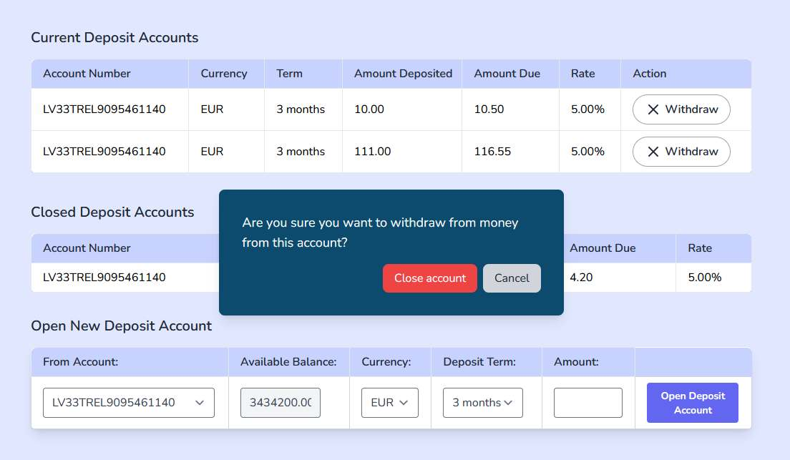
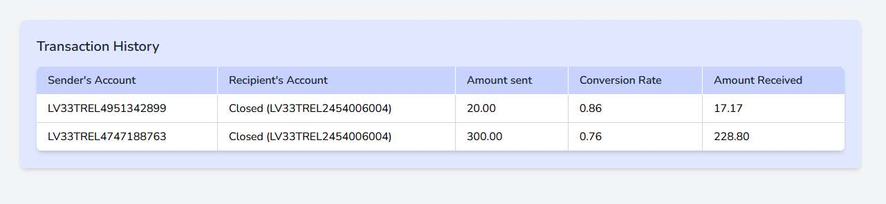
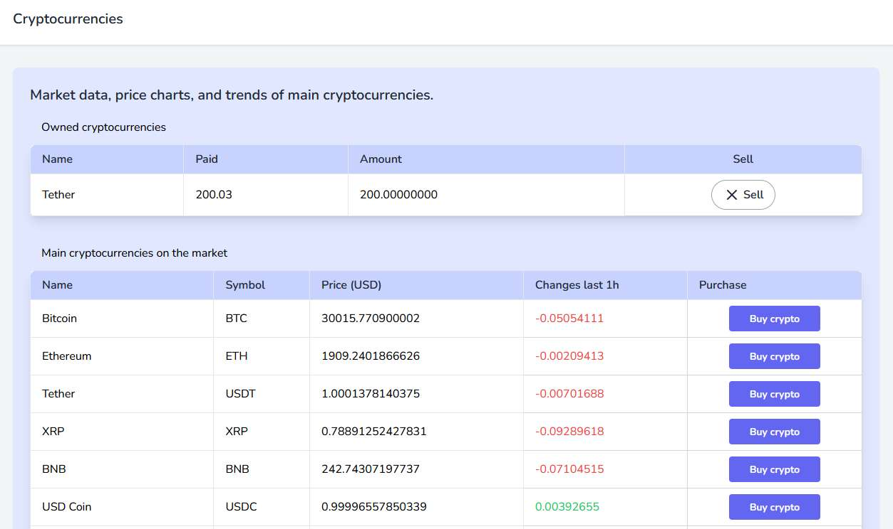
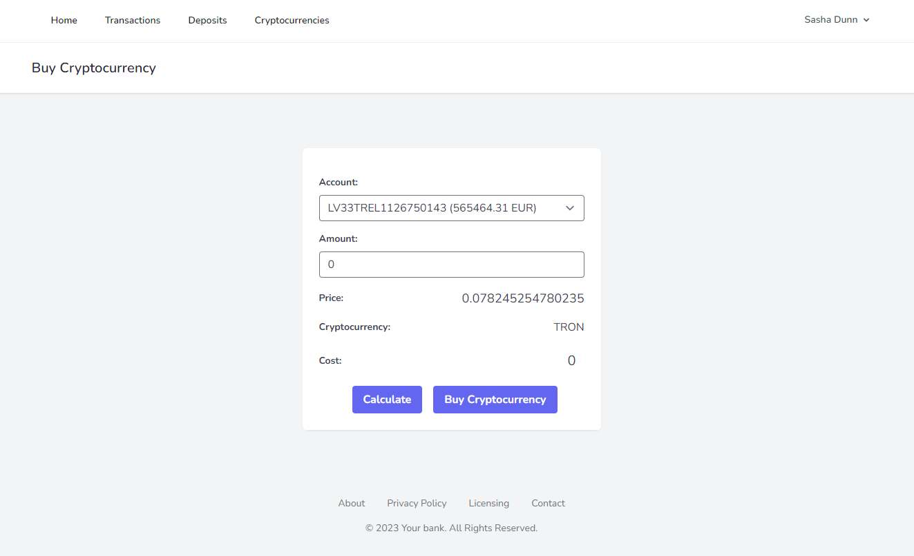

# Bank application

Bank is a Laravel 8 and PHP 7.3 application.

### Installation

To install Bank application, follow these steps.

1. Clone the repository to your local machine using the following command:

    git clone https://github.com/azemitis/bank.git

2. Navigate to the project directory:

    cd bank

3. Install the dependencies using Composer:

    composer install

4. Install npm dependencies:

    npm install

5. Make a copy of the .env.example file and rename it to .env:

    copy .env.example .env

6. Setup correct name and password for the database (root, root default).

7. Generate new application key:

    php artisan key:generate

8. Run application:

    php artisan serve

## Additional remarks
Cryptocurrency page requires https://coinmarketcap.com/ API key as variable "CMC_API_KEY" in .env file.

Google Authenticator application with a 30-second code expiration time is used for approval of transactions inside the application.
2FA Secret Key is published in profile upon registration.
